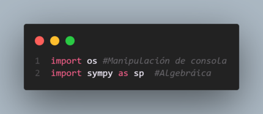
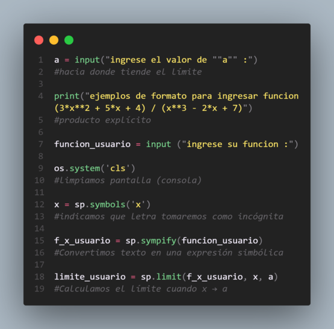

 
### Trabajo Integrador Analisis I (UCP) 
# 📌 Calculadora de Límites en Consola (grupo 4)

¡Bienvenido a la Calculadora de Límites en Consola! 🧮✨

Este programa permite calcular el límite de una función ingresada por el usuario de una manera interactiva y sencilla, directamente desde la terminal.

---

## 🚀 Características

✅ Calcula el límite de funciones algebraicas.
✅ Muestra ejemplos para guiar al usuario en el formato correcto.
✅ Interfaz en consola clara y fácil de usar.
✅ Posibilidad de repetir cálculos sin reiniciar el programa.
---




---

## 🖥 Instalación (parte I) Python y Uso de la Consola

Para ejecutar este programa, primero necesitas instalar Python y asegurarte de que puedes utilizar la consola. Sigue estos pasos:

1. **Descargar e instalar Python**
   - Visita la página oficial de Python: [https://www.python.org/downloads/](https://www.python.org/downloads/)
   - Descarga la versión más reciente para tu sistema operativo.
   - Durante la instalación, asegúrate de marcar la opción **"Add Python to PATH"**.
   
2. **Verificar la instalación**
   - Abre una terminal (CMD en Windows, Terminal en macOS/Linux). Para esto puedes presionar la tecla WIN -> escribir cmd en la barra de búsqueda -> luego presionar enter.
   - Escribe el siguiente comando y presiona Enter:
     ```bash
     python --version
     ```
   - Si ves un mensaje con la versión de Python instalada, ¡todo está listo!

3. **Usar la consola**
   - Para abrir la consola interactiva de Python, simplemente ejecuta:
     ```bash
     python
     ```
   - Verás que aparece `>>>`, indicando que puedes escribir comandos de Python directamente.
   - Para salir, usa `exit()` o presiona `Ctrl + Z` en Windows o `Ctrl + D` en macOS/Linux.

---

## 📦 Instalación (parte II) Calcular límites

Para ejecutar este programa en su sistema, siga estos pasos:

0. **Dirigete a cualquier carpeta donde vas a posicionar el programa y presiona click derecho -> abrir terminal**

1. **Instala asistente de GitHub para acceder al repositorio del programa de Límites**
   ```bash
   pip install dulwich
   ```

2. **Clonar este repositorio**
   ```bash
   python -m dulwich clone https://github.com/arke-off/integrador-analisis1.git
   ```

3. **Instalar las dependencias**
   Este programa requiere `SymPy`, una librería de álgebra simbólica para Python. Si aún no la tiene instalada, puede hacerlo con:
   ```bash
   pip install sympy
   ```

4. **Ejecutar el programa**
   ```bash
   python calculadora_limites.py
   ```

---

## 📝 Uso

Una vez ejecutado, el programa mostrará un menú con las siguientes opciones:

1️⃣ **Calcular el límite de una función**
   - Se solicita ingresar la función en notación Python.
   - Se pide el valor al que tiende la variable `x`.
   - Se muestra el resultado del límite calculado.

2️⃣ **Ver un ejemplo de función**
   - Se proporciona una función de ejemplo y se explica su formato correcto.

3️⃣ **Salir del programa**
   - Finaliza la ejecución del código.

---

## 🛠 Ejemplo de Entrada y Salida

### 🔹 Entrada
```
Ingrese el valor de "a" hacia donde tiende su límite: ∞
Ingrese su función aquí: (x**2 + 5*x + 4) / (x**3 - 2*x + 7)
```

### 🔹 Salida
```
El límite de la función ingresada cuando x → ∞ es: 0
```

---

## 📌 Notas Importantes

🔹 Ingrese las funciones respetando la sintaxis de Python.
🔹 Use `**` para potencias (Ejemplo: `x**2` en lugar de `x^2`).
🔹 Para representar infinito, utilice `oo`.
🔹 El programa borra la pantalla en cada iteración para mantener una interfaz limpia.

---

## 📜 Licencia

Este proyecto es de código abierto y puede ser utilizado con fines educativos y personales. 🚀

---

💡 **¡Esperamos que esta herramienta te ayude en tus estudios de cálculo!** 😃


